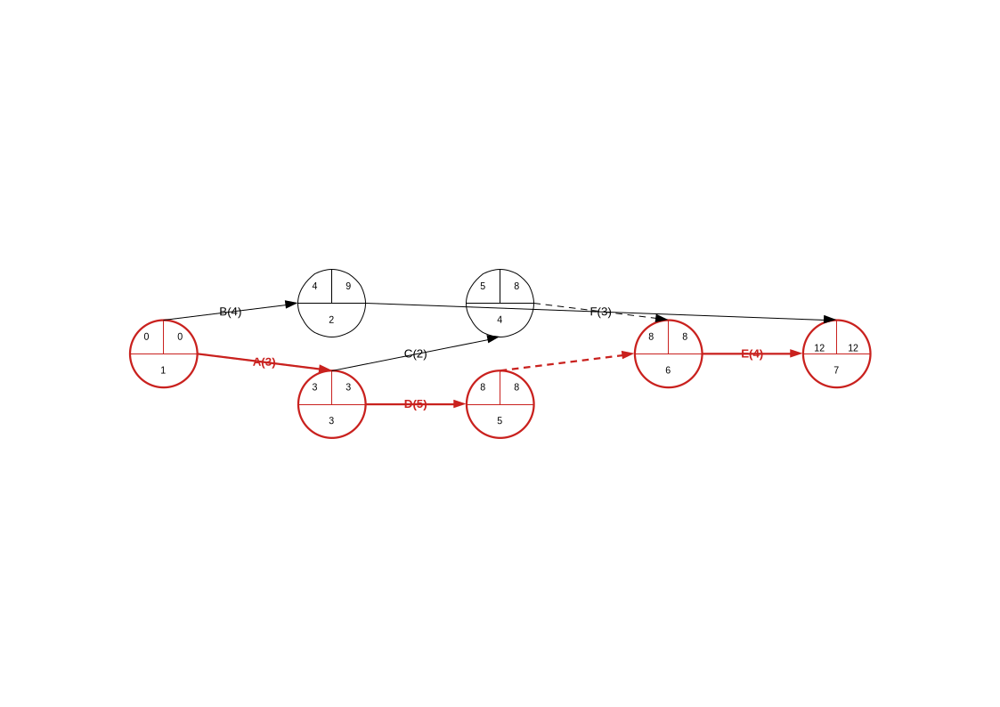

# lo-pert

PERT diagrams in LibreOffice: give it a precedence table in Calc and it draws the
classic **activity-on-arrow** network — events as three-region circles, activities as
labelled arrows — computes every event's early and late times, inserts the dummy
activities the precedences require, and marks the critical path.

```sh
curl -fsSL https://raw.githubusercontent.com/gortazar/lo-pert/main/install.sh | sh
```

That downloads the `.oxt` from the latest release, checks it against the published
SHA256SUMS and registers it with `unopkg`. Nothing is compiled. Restart LibreOffice
and a **PERT** menu appears in Draw, Impress and Calc.

Prefer to do it by hand? Download `lo-pert-<version>.oxt` from the
[releases page](https://github.com/gortazar/lo-pert/releases) and add it in
*Tools ▸ Extension Manager ▸ Add*. LibreOffice 7.0 or newer; tested against 25.8.

## Using it

Put the activities in three columns of a Calc sheet — identifier, duration,
immediate predecessors — select them, and run **PERT ▸ Diagram from Precedence
Table**.

| Activity | Duration | Predecessors |
| -------- | -------- | ------------ |
| A        | 3        |              |
| B        | 4        |              |
| C        | 2        | A            |
| D        | 5        | A            |
| E        | 4        | C, D         |
| F        | 3        | B            |



The diagram is drawn on a new Draw document (or on the page of the Draw or Impress
document you already have open) and is then yours: it is generated once and freely
editable, not linked back to the table.

### How to read it

Each circle is an **event** — a moment when some activities have finished and others
may start:

```
 ┌───────────┐
 │  E  │  L  │   E = early time: the soonest the event can happen
 ├─────┴─────┤   L = late time:  the latest it can happen without
 │     n     │       delaying the project
 └───────────┘   n = event number
```

* **Arrows are activities**, labelled `identifier(duration)` — `A(3)` is activity A
  taking 3 days. A single expected duration per activity, as in CPM; the
  three-estimate form (optimistic / most likely / pessimistic) is not implemented.
* **Dashed arrows are dummy activities**: zero duration, no label. They carry a
  precedence that would otherwise be impossible to draw — where two activities share
  *some* but not all of their predecessors, an arrow alone would either lose a
  constraint or invent one.
* **Red marks the critical path**: the events with no slack (E = L), the activities
  with no float, and the dummies between them. Delay any of these and the project
  slips.
* Event numbers increase along every arrow, so an arrow always runs from a lower
  number to a higher one.

### The rest of the menu

* **Insert State** puts a single event circle in the middle of the page, with
  placeholder numbers to type over. Each region is its own text shape inside the
  group, so editing one number leaves the others alone.
* **Insert Action Between Two States** joins two selected state circles with an
  arrow, glued to both: drag either circle and the arrow follows.

### What it rejects

A table with problems draws nothing at all and reports every problem at once, naming
the row each one is on: cycles (`circular precedence: A -> B -> C -> A`), unknown
predecessors, duplicate identifiers, missing, negative or non-numeric durations, and
an empty table.

Predecessors may be separated by commas, semicolons or spaces. A header row is
recognised and skipped. Durations may use either `.` or `,` as the decimal separator.

## How the network is built

Turning a precedence table into an activity-on-arrow network is the interesting part,
because activities that share *some* predecessors cannot share an event:

* Activities with the same set of immediate predecessors start at the same event.
* Every other activity ends at its own event, which feeds dummy activities into the
  events that need it. Two merges keep the common cases dummy-free: an activity that
  is the sole predecessor of a group ends where that group starts, and an activity
  nobody waits for ends at the project's finish event.
* Two activities running between the same pair of events are split by a dummy, so no
  two arrows are drawn on top of each other.
* Events are placed in columns by their level (longest path in arcs) and ordered
  within a column by barycentre sweeps, which keeps crossings down. The same table
  always produces the same drawing.

Minimising the number of dummy activities is NP-hard, so lo-pert aims at *correct and
deterministic* rather than *minimal*. "Correct" is pinned down by property-based
tests over random tables: the network implies exactly the transitive closure of the
stated precedences — never one constraint more, never one less.

## Development

```sh
nix flake check       # everything: unit tests, headless tests, packaging
nix develop           # LibreOffice, python with pytest and hypothesis
pytest tests/unit     # the pure core: table, network, times, layout
pytest tests/integration   # headless LibreOffice with the built .oxt installed
./build.sh            # dist/lo-pert-<version>.oxt
```

The core (`src/lopert/table.py`, `network.py`, `times.py`, `layout.py`,
`diagram.py`) imports no UNO at all — a test asserts it — so the interesting logic is
testable without starting LibreOffice. Everything that touches the drawing API lives
in `drawing.py`, `documents.py`, `dialogs.py` and `commands.py`, and is covered by
the headless tests, which install the real extension and read the drawn page back.

`scripts/with-soffice.sh <command>` runs anything against a throwaway headless office
with the extension installed; that is how `scripts/screenshot.py` produces the
picture above.

## Licence

MIT.
